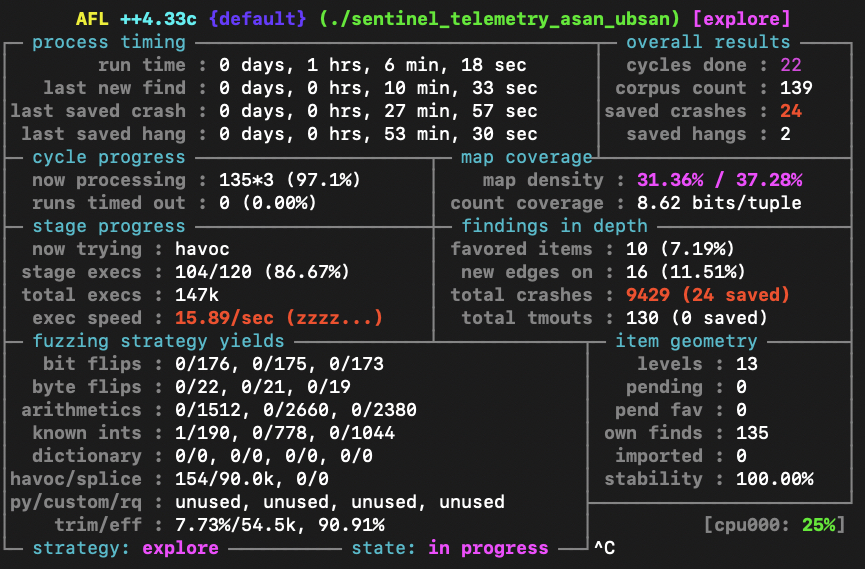
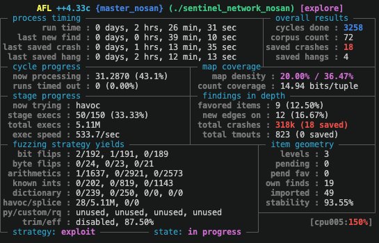
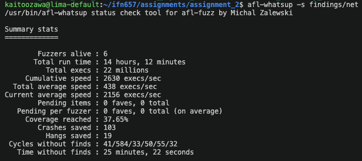
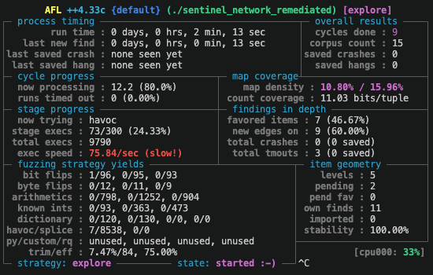

# IFN657 Assignment 2: Vulnerability Discovery

**Group ID:** `Group_01`
**Submission Date:** `[16 October 2026]`  

### Team Members & Workload Distribution
| Student Name | Student ID | Email Address | Assigned Subtasks / Roles | Contribution (%) |
| :--- | :--- | :--- | :--- | :--- |
| `Claire Lin`  | `[n0000001]`  | `c229.lin@connect.qut.edu.au`    | `Fuzz testing of sentinel_telemetry.c` | 33.3% |
| `Rachel Lim`  | `[n12284181]` | `r20.lim@connect.qut.edu.au`     | `Fuzz testing of sentinel_payload.c`   | 33.3% |
| `Kaito Ozawa` | `[n12224774]` | `kaito.ozawa@connect.qut.edu.au` | `Fuzz testing of sentinel_network.c`   | 33.3% |

**Submission Files (Canvas):**
- `Group_01.pdf` (compiled from this completed Markdown report template)
- `Group_01.zip` (archive containing `seeds/`, `crashes/`, `exploits/`, `remediated_src/`, `README.md`, and `Group_XX.cast`)

---

## Table of Contents
1. [Task 0: Executive Summary](#1-task-0-executive-summary)
2. [Task 1: Setup](#2-task-1-setup)
3. [Task 2: Fuzzing Execution](#3-task-2-fuzzing-execution)
4. [Task 3: Vulnerability Analysis](#4-task-3-vulnerability-analysis)
5. [Task 4: Code Remediation](#5-task-4-code-remediation)
6. [Task 5: Proof-of-Concept Exploitation](#6-task-5-proof-of-concept-exploitation)

---

## 1. Task 0: Executive Summary

| Task | Status | `asciinema` Timestamp (mm:ss) | Notes |
| :--- | :--- | :--- | :--- |
| **Task 0: Claims, Demo & Teamwork** | [Completed / Incomplete] | [00:00] | Any additional notes. |
| **Task 1: Setup** | [Completed / Incomplete]  | [00:30] | Briefly describe how this task is completed. |
| **Task 2: Fuzzing Execution** | [Completed / Incomplete]  | [01:30] | Briefly describe how this task is completed. |
| **Task 3: Vulnerability Analysis** | [Completed / Incomplete]  | [03:00] | Briefly describe how this task is completed. |
| **Task 4: Code Remediation** | [Completed / Incomplete]  | [05:30] | Briefly describe how this task is completed. |
| **Task 5: Proof-of-Concept Exploitation** | [Completed / Incomplete]  | [07:00] | Briefly describe how this task is completed. |
| **Total Number of Distinct Vulnerabilities Found** | [The total number] | N/A | Any additional notes. |

---

## 2. Task 1: Setup

### 2.1 Compilation & Target Environment Setup

sentinel_telemetry
```bash
# Environment configuration
echo core | sudo tee /proc/sys/kernel/core_pattern

# Compilation commands with AFL++ instrumentation
afl-clang-fast -g -o sentinel_telemetry_nosan sentinel_telemetry.c

# Compilation commands with AddressSanitizer and UndefinedBehaviorSanitizer
export AFL_USE_ASAN=1
export AFL_USE_UBSAN=1
afl-clang-fast -g -o sentinel_telemetry_asan_ubsan sentinel_telemetry.c
```

sentinel_payload
```bash
# Compilation commands with AFL++ instrumentation
afl-clang-fast -m32 -std=c99 -w -g -o sentinel_payload_nosan sentinel_payload.c

# Compilation commands with AddressSanitizer and UndefinedBehaviorSanitizer
export AFL_USE_ASAN=1
export AFL_USE_UBSAN=1
afl-clang-fast -m32 -std=c99 -w -g -o sentinel_payload_asan_ubsan sentinel_payload.c

# Compilation commands with MemorySanitizer
export AFL_USE_MSAN=1
afl-clang-fast -std=c99 -w -g -o sentinel_payload_msan sentinel_payload.c
```

sentinel_network
```bash
echo core | sudo tee /proc/sys/kernel/core_pattern

# Compilation commands with AFL++ instrumentation
afl-clang-fast -m32 -std=c99 -w -g -o sentinel_network_nosan sentinel_network.c

# Compilation commands with AddressSanitizer and UndefinedBehaviorSanitizer
AFL_USE_ASAN=1 AFL_USE_UBSAN=1 afl-clang-fast -m32 -std=c99 -w -g -o sentinel_network_asan_ubsan sentinel_network.c

# Compilation commands with MemorySanitizer
AFL_USE_MSAN=1 afl-clang-fast -std=c99 -w -g -o sentinel_network_msan sentinel_network.c
```

### 2.2 Seed Corpus

#### Target 1: `sentinel_telemetry` Seed Set
| Seed Filename | Input Content / Syntax Summary | Target Branch / Parsing State Exercised |
| :--- | :--- | :--- |
| `seed_telemetry.conf` | Starter configuration with nominal directives | Base parser validation and comment handling |
| `seed_tel_2.conf` | `aux_buffer_request=64` | Auxiliary buffer request |
| `seed_tel_3.conf` | Comment, blank line, and two `key=value` entries | Basic parsing with comments and blank lines |
| `seed_tel_4.conf` | Sensor ID, calibration factor, and auxiliary buffer request | Multiple telemetry directives in one input |

#### Target 2: `sentinel_payload` Seed Set
| Seed Filename | Dimensions & Label | Payload Size | Target Branch / Parsing State Exercised |
| :--- | :--- | :--- | :--- |
| `seed_payload.bin`   | `PAYLOAD_FRAME 8 8 1 RADAR_SCAN_01` | 64 bytes | Standard 2D observation matrix |
| `seed_payload_1.bin` | `PAYLOAD_FRAME 1 1 1 A`  | 1 byte | Exercises the minimum valid label and payload boundary. |
| `seed_payload_2.bin` | `PAYLOAD_FRAME 8 8 16 B` | 1024 bytes | Exercises the maximum valid payload boundary. |
| `seed_payload_3.bin` | `PAYLOAD_FRAME 1 1 1 CCCCCCCCCCCCCCCCCCCCCCCCCCCCCCCCCCCCCCCCCCCCCCCCCCCCCCCCCCCCCCC` | 1 byte | Exercises the maximum valid label boundary. |
| `seed_payload_4.bin` | `PAYLOAD_FRAME 1 1 1`    | 1 byte | Exercises the jump to log_payload_error() with a single whitespace label. |
| `seed_payload_5.bin` | `PAYLOAD_FRAME 2 4 8 E`  | 128 bytes | Exercises fread() using a valid payload larger than expected_data_size. |

#### Target 3: `sentinel_network` Seed Set
| Seed Filename | Magic Header & Type | Payload Length | Target Branch / Parsing State Exercised |
| :--- | :--- | :--- | :--- |
| `seed_net_1.bin` | `0x12345678`, Type 1          | 16 bytes | Type 1, small payload                               |
| `seed_net_2.bin` | `0x12345678`, Type 1          | 48 bytes | Type 1, larger payload within header summary buffer |
| `seed_net_3.bin` | `0x12345678`, Type 2          | 4 bytes  | Type 2, payload below 8-byte overflow threshold.    |
| `seed_net_4.bin` | `0x12345678`, Type 1 + Type 2 | 20 bytes | Multi-message input (seeds 1 + 3)                   |

### 2.3 Seed Generation Methodology & Helper Scripts

#### sentinel_telemetry: `No helper script was needed.`
The additional seeds were manually created using the valid `key=value` format and different inputs handled by `sentinel_telemetry.c`.

#### sentinel_payload: `generate_seed_payload.py`
The helper script shown below demonstrates seed generation for `seed_payload_5.bin`. The sentinel_payload program expects a file input containing a header line with exactly four values: width, height, depth, and label. A payload should follow after the newline.

```python
"""
Generate a file input for the sentinel_payload program.
"""

width = 2
height = 4
depth = 8
label = "E"

header_line = f"PAYLOAD_FRAME {width} {height} {depth} {label}\n"
payload = b"E" * 128

with open("seed_payload_5.bin", "wb") as f:
    f.write(header_line.encode("ascii"))
    f.write(payload)
```

#### sentinel_network: seeds_net.py
```python
import struct

def pkt(t, n):
    return struct.pack("<IHH", 0x12345678, t, n) + b"A" * (n - 1) + b"\x00"

seeds = [
    pkt(1, 16),
    pkt(1, 48),
    pkt(2, 4),
    pkt(1, 16) + pkt(2, 4),
]

for i, data in enumerate(seeds, 1):
    open(f"seeds/seed_net_{i}.bin", "wb").write(data)
```

---

## 3. Task 2: Fuzzing Execution

### 3.1 Fuzzing Execution & Advanced Techniques

#### sentinel_telemetry

Baseline fuzzing:
```bash
afl-fuzz -i seeds -o fuzz_out_nosan ./sentinel_telemetry_nosan @@
```
Dictionary: `dict`
```bash
log_event="log_event="
stream_multiplier="stream_multiplier="
aux_buffer_request="aux_buffer_request="
sensor_id="sensor_id_"
cal_factor="cal_factor_"
delimiter="="
```

Dictionary-assisted fuzzing:
```bash
afl-fuzz -i seeds -o fuzz_out_dict -x dict ./sentinel_telemetry_nosan @@
```

Sanitizer-guided fuzzing:
```bash
afl-fuzz -i seeds -o fuzz_out_asan_ubsan -m none ./sentinel_telemetry_asan_ubsan @@
```
**Technical Justification:**
The baseline campaign was used to check the initial fuzzing results. The dictionary included telemetry directives and `key=value` syntax to help AFL++ generate inputs that match the expected format. The dictionary campaign reached the same edge coverage as the baseline and found a slightly larger corpus. ASan and UBSan were also used to detect memory and undefined behaviour issues during fuzzing.

#### sentinel_payload

To enable persistent mode, the `main()` function in `sentinel_payload.c` was modified:

```c
int old_main(int argc, char **argv) {
    if (argc != 2) {
        fprintf(stderr, "Usage: %s <payload_binary_file>\n", argv[0]);
        return 1;
    }
    
    FILE *fp = fopen(argv[1], "rb");
    if (!fp) {
        perror("Failed to open scientific payload file");
        return 1;
    }
    
    printf("=== Sentinel-1 Scientific Payload Ingestion Subsystem ===\n");
    int result = parse_payload_file(fp);
    
    fclose(fp);
    cleanup_active_frame();
    
    return (result == 0) ? 0 : 1;
}

int main(int argc, char **argv) {
    int res = 0;
    while (__AFL_LOOP(10000)) {
        global_frame = NULL;
        res = old_main(argc, argv);
    }
    return res;
}
```

To improve fuzzer mutations, a simple fuzzer dictionary (i.e., `sentinel_payload.dict`) was created:

```
header="PAYLOAD_FRAME"
format_string_trigger_1="%n"
format_string_trigger_2="%x"
uaf_trigger="1337"
```

Parallel, dictionary-assisted fuzzing was conducted on:
- An AFL++ instrumented and unsanitised sentinel_payload program.
- An AFL++ instrumented with ASan and UBSan enabled sentinel_payload program.
- An AFL++ instrumented with MSan enabled sentinel_payload program.

```bash
echo core | sudo tee /proc/sys/kernel/core_pattern
afl-fuzz -i seeds -o out -x sentinel_payload.dict -m none -M nosan ./sentinel_payload_nosan @@
afl-fuzz -i seeds -o out -x sentinel_payload.dict -m none -S asan_ubsan ./sentinel_payload_asan_ubsan @@
afl-fuzz -i seeds -o out -x sentinel_payload.dict -m none -S msan ./sentinel_payload_msan @@
```

**Technical Justification:**

Enabling persistent mode in AFL++ removes the significant overhead associated with restarting the process after every test case. This improves fuzzing efficiency and execution speed, allowing a greater number of test cases to be executed per second.

The fuzzer dictionary, `sentinel_payload.dict`, was used to ensure that generated inputs contained the minimum required structure to pass the initial header line validation. Specifically, inputs must contain the string `PAYLOAD_FRAME`, followed by `width`, `height`, `depth`, and `label` values, in order to reach subsequent processing functions. The dictionary also includes format string and use-after-free (UAF) triggers, enabling the exploration of distinct execution paths and increasing the likelihood of exposing vulnerabilities.

Parallelisation was utilised to run multiple fuzzing instances simultaneously. Each instance targeted different AFL++ instrumentation variants of the `sentinel_payload` program. This increases overall throughput and enables different execution paths to be explored concurrently.

Lastly, the `-m none` option was applied to all fuzzing instances to disable AFL++'s memory limit. This further improved execution speeds.

#### sentinel_network

persistent in-process fuzzing: sentinel_network.c
```c
int old_main(int argc, char **argv) {
}

int main(int argc, char **argv) {
    int res = 0;
    while (__AFL_LOOP(10000)) {
        memset(active_telecommands, 0, sizeof(active_telecommands));
        active_telecommand_count = 0;
        res = old_main(argc, argv);
    }
    return res;
}
```

dictionaries: dict
```bash
magic="\x78\x56\x34\x12"
type_1="\x01\x00"
type_2="\x02\x00"
type_3="\x03\x00"
len_0="\x00\x00"
len_4="\x04\x00"
len_16="\x10\x00"
len_1016="\xf8\x03"
len_1024="\x00\x04"
len_max="\xff\xff"
```

multi-core parallel fuzzing
```bash
AFL_NO_UI=1 nohup afl-fuzz -i seeds -o findings -x dict -S asan_ubsan -- ./sentinel_network_asan_ubsan @@ > /dev/null 2>&1 &
AFL_NO_UI=1 nohup afl-fuzz -i seeds -o findings -x dict -S msan       -- ./sentinel_network_msan       @@ > /dev/null 2>&1 &
AFL_NO_UI=1 nohup afl-fuzz -i seeds -o findings -x dict -S nosan1     -- ./sentinel_network_nosan      @@ > /dev/null 2>&1 &
AFL_NO_UI=1 nohup afl-fuzz -i seeds -o findings -x dict -S nosan2     -- ./sentinel_network_nosan      @@ > /dev/null 2>&1 &
AFL_NO_UI=1 nohup afl-fuzz -i seeds -o findings -x dict -S nosan3     -- ./sentinel_network_nosan      @@ > /dev/null 2>&1 &

afl-fuzz -i seeds -o findings -x dict -M master_nosan -- ./sentinel_network_nosan @@

# open another terminal and check the aggregated status
afl-whatsup -s findings

# kill all the processes
pkill afl-fuzz
```

**Technical Justification:**
Persistent mode (`__AFL_LOOP`) removes the cost of starting a new process for each input, which greatly increases exec/s. The dictionary supplies the magic header, message types and boundary lengths so mutations get past the header checks, and the parallel instances combine fast uninstrumented runs for coverage with ASan/UBSan and MSan builds that catch memory errors which would otherwise go undetected.

### 3.2 Campaign Performance & Coverage Metrics

| Target Program | Campaign Duration | Total Executions | Execution Speed (exec/s) | Total Paths Discovered | Unique Crashes Reported |
| :--- | :--- | :--- | :--- | :--- | :--- |
| `sentinel_telemetry` | 1.16 hours | 758K | 23.67/sec | 166 paths | 24 crashes |
| `sentinel_payload` | `[Hours]` | `[Executions]` | `[Exec/sec]` | `[Paths]` | `[Crashes]` | 
| `sentinel_network` | 2.4 hours | 22M | 2,630/sec | 72 paths | 103 crashes |

### 3.3 AFL++ Status Console Screenshots

sentinel_telemetry


sentinel_payload
```
[Insert Screenshot: sentinel_payload AFL++ Status Screen]
```

sentinel_network





---

## 4. Task 3: Vulnerability Analysis

### 4.1 Crash Triage Methodology

The same methodology was applied to all three targets. In the commands below, `{target}` is one of `telemetry`, `payload`, or `network`.

#### 1. replay all crashes with the ASan build and save full logs

```bash
mkdir -p crash_logs
for f in findings/*/crashes/id:*; do
  name=$(echo "$f" | tr '/:,' '___')
  timeout 10 ./sentinel_{target}_asan_ubsan "$f" > "crash_logs/$name.log" 2>&1
  echo "$f" >> "crash_logs/$name.log"   # record the original crash file on the last line
done
```

#### 2. build a bucket key (error type + top 3 frames) for each crash

```bash
for log in crash_logs/*.log; do
  key=$(awk '
    /ERROR: AddressSanitizer:/ && !type {
      match($0, /AddressSanitizer: [a-z-]+/); type=substr($0, RSTART+18, RLENGTH-18); next }
    type && /^ *#[0-9]+ / {
      sub(/^ *#[0-9]+ 0x[0-9a-f]+ in /, "")        # remove frame number and address
      gsub(/\/[^ ]*\//, "")                        # remove directory paths
      if ($0 ~ /:[0-9]+:[0-9]+$/) sub(/:[0-9]+$/, "")  # remove column number
      if ($0 ~ /^(__asan|__interceptor|__sanitizer)/) next  # skip ASan internal frames
      key = key " > " $0
      if (++n == 3) exit                           # stop after top 3 frames
    }
    type && n && /^$/ { exit }                     # stop at the end of the first stack
    END { print (type ? type : "no-repro") " |" key }' "$log")
  printf "%s\t%s\n" "$key" "$(tail -1 "$log")"
done > crash_buckets.tsv
```

#### 3. count crashes per bucket, pick one representative crash and minimise it

```bash
mkdir -p crash_analysis
declare -A num                                                   # per-error-type counter
awk -F'\t' '
  { cnt[$1]++; if (!($1 in rep)) rep[$1] = $2 }                  # count crashes and keep the first file per bucket
  END { for (k in cnt) printf "%d\t%s\t%s\n", cnt[k], k, rep[k] }
' crash_buckets.tsv \
| sort -t$'\t' -k1,1nr \
| while IFS=$'\t' read -r cnt key rep; do
    type=${key%% |*}                                             # error type (text before " |")
    num[$type]=$(( ${num[$type]:-0} + 1 ))
    name=$(printf "%s%02d" "$type" "${num[$type]}")              # e.g. heap-buffer-overflow01
    printf "[%d crashes] %s\nbucket: %s\nrepresentative crash: %s\n\n" "$cnt" "$name" "$key" "$rep"
    [ "$type" = "no-repro" ] && continue                         # skip crashes that did not reproduce
    afl-tmin -i "$rep" -o "crash_analysis/$name.bin" -- ./sentinel_{target}_asan_ubsan @@ < /dev/null > /dev/null 2>&1  # keep only the bytes needed to trigger the same crash
  done
```

#### 4. validate and inspect each representative crash

After minimisation, verify whether a valid minimised `.bin` file is produced and still reproduces the crash. Follow Step 4-1 if a valid minimised file is available; otherwise, follow Step 4-2 using the original representative crash.

##### 4-1. inspect a successfully minimised representative
```bash
./sentinel_{target}_asan_ubsan crash_analysis/{name}.bin
```

##### 4-2. Inspect the original representative if no valid minimised file is available

If no valid minimised `.bin` file is produced, use the original representative crash instead:

```bash
./sentinel_{target}_asan_ubsan {original_representative_crash}
```

If the result is unclear, check the crash manually with GDB:

```bash
gdb ./sentinel_{target}_asan_ubsan
```

Then run:

```gdb
run {original_representative_crash}
```

Check the sanitizer/GDB output against the source code.

#### 5. decode the input as a packet sequence (`network` only)

```bash
xxd crash_analysis/{name}.bin
```

### 4.2 Discovered Vulnerabilities

---

#### 4.2.1 Vulnerability 1
| Field | Details |
| :--- | :--- |
| **Vulnerability Name** | `[e.g. Format String Vulnerability in Telemetry Logger]` |
| **CWE Classification** | `[e.g. CWE-134: Use of Externally-Controlled Format String]` |
| **Target Component** | `[e.g. sentinel_telemetry.c]` |
| **Vulnerable Location** | `[Function name, line number, and code snippet]` |
| **Reproducing Input File** | `[e.g. crashes/id_000000_telemetry_crash.conf]` |

**Triggering Input & Reproduction Command:**
```bash
# Provide command to reproduce the crash

```

**Root Cause Analysis:**
`[Explain the technical root cause, memory state, and why the input leads to corruption]`

**GDB / Sanitiser Evidence:**
```text
[Paste annotated Sanitiser error report or GDB backtrace here]
```

**Exploitability Assessment:**
`[Assess the severity and realistic attacker impact (e.g. memory leak, DoS, arbitrary write)]`

---

#### 4.2.2 Vulnerability 2
| Field | Details |
| :--- | :--- |
| **Vulnerability Name** | `[e.g. Integer Overflow in Stream Buffer Calculation]` |
| **CWE Classification** | `[e.g. CWE-190: Integer Overflow or Wraparound]` |
| **Target Component** | `[e.g. sentinel_telemetry.c]` |
| **Vulnerable Location** | `[Function name, line number, and code snippet]` |
| **Reproducing Input File** | `[e.g. crashes/id_000001_stream_overflow.conf]` |

**Triggering Input & Reproduction Command:**
```bash
# Provide command to reproduce the crash

```

**Root Cause Analysis:**
`[Explain the technical root cause, memory state, and why the input leads to corruption]`

**GDB / Sanitiser Evidence:**
```text
[Paste annotated Sanitiser error report or GDB backtrace here]
```

**Exploitability Assessment:**
`[Assess the severity and realistic attacker impact]`

---

#### 4.2.3 Vulnerability X (numbered sequentially for each distinct vulnerability)
| Field | Details |
| :--- | :--- |
| **Vulnerability Name** | `[e.g. Stack Buffer Overflow in Frame Label Processing]` |
| **CWE Classification** | `[e.g. CWE-121: Stack-based Buffer Overflow]` |
| **Target Component** | `[e.g. sentinel_payload.c]` |
| **Vulnerable Location** | `[Function name, line number, and code snippet]` |
| **Reproducing Input File** | `[e.g. crashes/id_000002_payload_label_overflow.bin]` |

**Triggering Input & Reproduction Command:**
```bash
# Provide command to reproduce the crash

```

**Root Cause Analysis:**
`[Explain the technical root cause, memory state, and why the input leads to corruption]`

**GDB / Sanitiser Evidence:**
```text
[Paste annotated Sanitiser error report or GDB backtrace here]
```

**Exploitability Assessment:**
`[Assess the severity and realistic attacker impact]`

---

#### 4.2.11 Vulnerability 11
| Field | Details |
| :--- | :--- |
| **Vulnerability Name** | `Stack Buffer Overflow in Telecommand Header Logging` |
| **CWE Classification** | `CWE-121: Stack-based Buffer Overflow` (+ `CWE-125: Out-of-bounds Read`) |
| **Target Component** | `sentinel_network.c` |
| **Vulnerable Location** | `log_telecommand_header()` L43 (root cause) → `sprintf()` (crash site): `sprintf(header_summary, "... Data: %s", ..., (char *)pkt->data);` |
| **Reproducing Input File** | `crash_analysis/stack-buffer-overflow01.bin`, `crash_analysis/stack-buffer-overflow02.bin` |

**Triggering Input & Reproduction Command:**
```bash
xxd crash_analysis/stack-buffer-overflow01.bin
# 00000000: 7856 3412 0100 3000 4141 4141 2b53 4141  xV4...0.AAAA+SAA   <- packet 1: type=1, length=48 (no `00` in data, so %s reads beyond length)
# 00000010: 415a 4141 4141 4141 4141 7a41 4141 4141  AZAAAAAAAAzAAAAA
# 00000020: 4141 4141 4141 4141 7a41 4141 4141 4141  AAAAAAAAzAAAAAAA
# 00000030: 4141 4141 4141 3e41 4141 4141 4a41 4141  AAAAAA>AAAAAJAAA
# 00000040: 5541 4141 413e 4141 4141 414a 4141 4141  UAAAA>AAAAAJAAAA
# ...

xxd crash_analysis/stack-buffer-overflow02.bin
# 00000000: 7856 3412 0200 0400 5d41 4100 7800 3412  xV4.....]AA.x.4.   <- packet 1: type=2, length=4
# ...                                                                   
# 00003c00: 7856 3412 0300 0400 4141 4178 5634 1241  xV4.....AAAxV4.A   <- packet 2: type=3, length=4 (no `00` in data, so %s reads beyond length)
# 00003c10: 4141 4141 4141 4141 4141 4141 4141 4141  AAAAAAAAAAAAAAAA
# ...

./sentinel_network_asan_ubsan crash_analysis/stack-buffer-overflow01.bin   # overflow write into header_summary
./sentinel_network_asan_ubsan crash_analysis/stack-buffer-overflow02.bin   # overflow read past input_stream
```

**Root Cause Analysis:**
The `log_telecommand_header()` function stores the local variable `char header_summary`, a 128-byte buffer, in its stack frame, and the `sprintf` function writes a formatted string into this variable. Because `sprintf` cannot limit the number of bytes it writes, large inputs could cause a stack buffer overflow. In the first crash file, the packet size is 48 bytes, which fits within the buffer. However, the data did not end with `00`, so the function could not recognise the end of the string. It kept reading past the end of the data until the overflow error was flagged. In the second crash file, the packet length is 4 bytes, but the absence of `00` resulted in reading beyond `uint8_t input_stream`, a 1024-byte buffer in `main()`.

**GDB / Sanitiser Evidence:**
```text
# stack-buffer-overflow1.bin
==2259390==ERROR: AddressSanitizer: stack-buffer-overflow on address 0xf2e00090 at pc 0x6333980e bp 0xff9413e8 sp 0xff940fb4
WRITE of size 131 at 0xf2e00090 thread T0
    #0 0x6333980d in vsprintf (/home/kaitoozawa.guest/ifn657/assignments/assignment_2/sentinel_network/sentinel_network_asan_ubsan+0x4380d) (BuildId: 006626492187b053caab2cf57757f866090167d7)
    #1 0x6333a72c in sprintf (/home/kaitoozawa.guest/ifn657/assignments/assignment_2/sentinel_network/sentinel_network_asan_ubsan+0x4472c) (BuildId: 006626492187b053caab2cf57757f866090167d7)
    #2 0x634002b8 in log_telecommand_header /home/kaitoozawa.guest/ifn657/assignments/assignment_2/sentinel_network.c:43:5
    #3 0x634002b8 in dispatch_telecommand /home/kaitoozawa.guest/ifn657/assignments/assignment_2/sentinel_network.c:120:5

# stack-buffer-overflow2.bin
==2259408==ERROR: AddressSanitizer: stack-buffer-overflow on address 0xe8b00410 at pc 0x56c50da6 bp 0xffff0058 sp 0xfffefbf0
READ of size 1017 at 0xe8b00410 thread T0
    #0 0x56c50da5 in printf_common(void*, char const*, char*) asan_interceptors.cpp.o
    #1 0x56c51616 in vsprintf (/home/kaitoozawa.guest/ifn657/assignments/assignment_2/sentinel_network/sentinel_network_asan_ubsan+0x43616) (BuildId: 006626492187b053caab2cf57757f866090167d7)
    #2 0x56c5272c in sprintf (/home/kaitoozawa.guest/ifn657/assignments/assignment_2/sentinel_network/sentinel_network_asan_ubsan+0x4472c) (BuildId: 006626492187b053caab2cf57757f866090167d7)
    #3 0x56d182b8 in log_telecommand_header /home/kaitoozawa.guest/ifn657/assignments/assignment_2/sentinel_network.c:43:5
    #4 0x56d182b8 in dispatch_telecommand /home/kaitoozawa.guest/ifn657/assignments/assignment_2/sentinel_network.c:120:5
```

**Exploitability Assessment:**
The write overflow is of moderate severity due to stack protections. Overflowing the 128-byte buffer corrupts the stack canary, which is detected on function return and aborts the program, leaving only a denial-of-service impact. Even if the canary were bypassed, ASLR hinders address prediction and the non-executable stack prevents injected shellcode from running. The read overflow, however, is not mitigated by these protections, as no memory is modified. If the out-of-bounds data is returned to the attacker, it may leak the canary or stack addresses, enabling bypass of the canary and ASLR.

---

#### 4.2.12 Vulnerability 12
| Field | Details |
| :--- | :--- |
| **Vulnerability Name** | `Integer Underflow in Payload Size Calculation Leading to Heap Buffer Overflow` |
| **CWE Classification** | `CWE-191: Integer Underflow` → `CWE-122: Heap-based Buffer Overflow` |
| **Target Component** | `sentinel_network.c` |
| **Vulnerable Location** | `calculate_telecommand_payload_size()` L89 (root cause) → `append_telecommand_payload()` L68 (crash site): `memcpy(msg->buffer, payload_data, copy_length);` |
| **Reproducing Input File** | `crash_analysis/negative-size-param01.bin` |

**Triggering Input & Reproduction Command:**
```bash
xxd crash_analysis/negative-size-param01.bin
# 00000000: 7856 3412 0100 0400 4141 4100            xV4.....AAA.   <- packet 1: type=1, length=4

./sentinel_network_asan_ubsan crash_analysis/negative-size-param01.bin
```

**Root Cause Analysis:**
The `calculate_telecommand_payload_size()` function contains a logic flaw. The program defines the total packet length as the header size (4-byte magic number + 2-byte type + 2-byte length = 8 bytes) plus the size of the packet data. However, this function calculates the payload size by subtracting the header size from the length field (`total_packet_length - header_overhead`). Because of this flaw, the payload is not read correctly. It also becomes a vulnerability when a packet's data size is smaller than its header size: the subtraction gives a negative value, which is then cast to a very large unsigned integer (e.g., 4 − 8 = −4 → 4294967292 in 32-bit environment). When the packet type is 1, the program allocates a 1024-byte message buffer on the heap. `memcpy` in `append_telecommand_payload()` then copies this oversized length into that buffer, which causes a heap overflow.

**GDB / Sanitiser Evidence:**
```text
# negative-size-param01.bin
==2259471==ERROR: AddressSanitizer: negative-size-param: (size=-4)
    #0 0x5af9c7c4 in __asan_memcpy (/home/kaitoozawa.guest/ifn657/assignments/assignment_2/sentinel_network/sentinel_network_asan_ubsan+0xbc7c4) (BuildId: 006626492187b053caab2cf57757f866090167d7)
    #1 0x5afea727 in append_telecommand_payload /home/kaitoozawa.guest/ifn657/assignments/assignment_2/sentinel_network.c:68:5
    #2 0x5afea727 in dispatch_telecommand /home/kaitoozawa.guest/ifn657/assignments/assignment_2/sentinel_network.c:128:17
```

**Exploitability Assessment:**
`[Assess the severity and realistic attacker impact]`

---

#### 4.2.13 Vulnerability 13
| Field | Details |
| :--- | :--- |
| **Vulnerability Name** | `Logical Flaw in Payload Size Calculation Leading to Heap Buffer Overflow` |
| **CWE Classification** | `CWE-122: Heap-based Buffer Overflow` |
| **Target Component** | `sentinel_network.c` |
| **Vulnerable Location** | `calculate_telecommand_payload_size()` L89 (root cause) → `append_telecommand_payload()` L68 (crash site): `memcpy(msg->buffer, payload_data, copy_length);` |
| **Reproducing Input File** | `crash_analysis/heap-buffer-overflow01.bin` |

**Triggering Input & Reproduction Command:**
```bash
xxd crash_analysis/heap-buffer-overflow01.bin
# 00000000: 7856 3412 0100 1000 4141 4141 4147 4141  xV4.....AAAAAGAA   <- packet 1: type=1, length=16
# 00000010: 4141 40f4 0100 2000 7856 3412 0200 0c00  AA@... .xV4.....   <- packet 2: type=2, length=12
# 00000020: 0000 1000 0041 4141 4141 3c00            .....AAAAA<.

./sentinel_network_asan_ubsan crash_analysis/heap-buffer-overflow01.bin
```

**Root Cause Analysis:**
The logical flaw in the payload size calculation described in Vulnerability 12 also causes a problem when the packet type is 2. When a packet's data size is larger than its header size, the `create_telecommand_record()` function allocates a message buffer that is 4 bytes smaller than required. As a result, a heap overflow occurs when `memcpy` in `append_telecommand_payload()` copies the packet data into the buffer. Here, a negative payload size cast to a very large unsigned integer does not cause the same overflow, as the program allocates the message buffer based on the calculated payload size.

**GDB / Sanitiser Evidence:**
```text
# heap-buffer-overflow01.bin
==2259513==ERROR: AddressSanitizer: heap-buffer-overflow on address 0xe5e00754 at pc 0x5e86c902 bp 0xff8dfe48 sp 0xff8dfa1c
WRITE of size 12 at 0xe5e00754 thread T0
    #0 0x5e86c901 in __asan_memcpy (/home/kaitoozawa.guest/ifn657/assignments/assignment_2/sentinel_network/sentinel_network_asan_ubsan+0xbc901) (BuildId: 006626492187b053caab2cf57757f866090167d7)
    #1 0x5e8ba6aa in append_telecommand_payload /home/kaitoozawa.guest/ifn657/assignments/assignment_2/sentinel_network.c:68:5
    #2 0x5e8ba6aa in dispatch_telecommand /home/kaitoozawa.guest/ifn657/assignments/assignment_2/sentinel_network.c:136:17
```

**Exploitability Assessment:**
`[Assess the severity and realistic attacker impact]`

---

#### 4.2.14 Vulnerability 14
| Field | Details |
| :--- | :--- |
| **Vulnerability Name** | `Heap Use After Free in Active Telecommands` |
| **CWE Classification** | `CWE-416: Use After Free` + `CWE-415: Double Free` |
| **Target Component** | `sentinel_network.c]` |
| **Vulnerable Location** | `emergency_command_cleanup()` L81-84 (root cause) → `release_telecommand_record()` L73 (crash site): `if (msg->buffer) {` |
| **Reproducing Input File** | `crash_analysis/heap-use-after-free01.bin`, `crash_analysis/heap-use-after-free02.bin` |

**Triggering Input & Reproduction Command:**
```bash
xxd crash_analysis/heap-use-after-free01.bin
# 00000000: 7856 3412 0100 1000 4141 4141 4141 4141  xV4.....AAAAAAAA   <- packet 1: type=1, length=16
# 00000010: 4141 4141 4141 4100 7856 3412 0300 0400  AAAAAAA.xV4.....   <- packet 2: type=3, length=4
# 00000020: 4141 4100                                AAA.

xxd crash_analysis/heap-use-after-free02.bin
# 00000000: 7856 3412 0300 0400 4141 0100 7856 3412  xV4.....AA..xV4.   <- packet 1: type=3, length=4 / packet 2: type=2, length=4
# 00000010: 0200 0400 4141 0100 7856 3412 0300 0400  ....AA..xV4.....   <- packet 3: type=3, length=4
# 00000020: 4141 0100 7856 3412 0300 0400 4141 4178  AA..xV4.....AAAx   <- packet 4: type=3, length=4
# ...

./sentinel_network_asan_ubsan crash_analysis/heap-use-after-free01.bin   # type=3 frees record, final cleanup at exit reuses it
./sentinel_network_asan_ubsan crash_analysis/heap-use-after-free02.bin   # type=3 frees record, next type=3 packet reuses it
```

**Root Cause Analysis:**
At the end of the `main()` function, `emergency_command_cleanup()` is called to free the remaining telecommand messages allocated on the heap, whose pointers are stored in the `telecommand_msg_t *active_telecommands[10]` array. However, when the packet type is 3, `dispatch_telecommand()` also calls the same cleanup function. As a result, any subsequent call to the cleanup function accesses and frees heap memory that has already been freed, causing a use-after-free and a double free. In the first crash file, `main()` calls the cleanup function a second time after a type-3 packet has been dispatched. In the second crash file, `dispatch_telecommand()` itself calls it a second time when it dispatches another type-3 packet.

**GDB / Sanitiser Evidence:**
```text
# heap-use-after-free01.bin
==2259585==ERROR: AddressSanitizer: heap-use-after-free on address 0xe6d00790 at pc 0x582f1be1 bp 0xffa358e8 sp 0xffa358e0
READ of size 4 at 0xe6d00790 thread T0
    #0 0x582f1be0 in release_telecommand_record /home/kaitoozawa.guest/ifn657/assignments/assignment_2/sentinel_network.c:73:14
    #1 0x582f1be0 in emergency_command_cleanup /home/kaitoozawa.guest/ifn657/assignments/assignment_2/sentinel_network.c:83:13

# heap-use-after-free02.bin
==2259598==ERROR: AddressSanitizer: heap-use-after-free on address 0xe5c00790 at pc 0x628abbe1 bp 0xffc6d028 sp 0xffc6d020
READ of size 4 at 0xe5c00790 thread T0
    #0 0x628abbe0 in release_telecommand_record /home/kaitoozawa.guest/ifn657/assignments/assignment_2/sentinel_network.c:73:14
    #1 0x628abbe0 in emergency_command_cleanup /home/kaitoozawa.guest/ifn657/assignments/assignment_2/sentinel_network.c:83:13
```

**Exploitability Assessment:**
`[Assess the severity and realistic attacker impact]`

---

#### 4.2.15 Vulnerability 15
| Field | Details |
| :--- | :--- |
| **Vulnerability Name** | `Misaligned Packet Header Access on Unaligned Stream Offset` |
| **CWE Classification** | `CWE-1319: Improper Protection against Unaligned Access` |
| **Target Component** | `sentinel_network.c` |
| **Vulnerable Location** | `validate_packet_integrity()` L94 (crash site): `if (pkt->magic != PROTOCOL_MAGIC_HEADER) {` |
| **Reproducing Input File** | `crash_analysis/illegal-instruction01.bin` |

**Triggering Input & Reproduction Command:**
This crash is a UBSan trap compiled as an illegal instruction, so it raises `SIGILL` with no textual sanitiser report. 
A representative `sig:04` crash was therefore taken as-is and inspected under GDB to recover the fault location:
```bash
xxd crash_analysis/illegal-instruction01.bin
# 00000000: 7856 3412 0100 0f00 3412 0200 4141 4a41  xV4.....4...AAJA   <- packet 1: type=1, length=15 (odd)
# 00000010: 4141 4141 4141 4141 4141 4100 7856 3412  AAAAAAAAAAA.xV4.
# ...

gdb -batch -ex run -ex bt --args ./sentinel_network_asan_ubsan crash_analysis/illegal-instruction01.bin
```

**Root Cause Analysis:**

A packet with an odd `length` (15) pushes the next packet header to an unaligned stream offset (23), so reading `pkt->magic` as a 4-byte `uint32_t` at L94 is a misaligned access that UBSan traps as an illegal instruction.

**GDB / Sanitiser Evidence:**
```text
# illegal-instruction01.bin
Program received signal SIGILL, Illegal instruction.
0x5666009d in validate_packet_integrity (pkt=<optimized out>, stream_len=<optimized out>) at sentinel_network.c:94
94          if (pkt->magic != PROTOCOL_MAGIC_HEADER) {
#0  0x5666009d in validate_packet_integrity (pkt=<optimized out>, stream_len=<optimized out>) at sentinel_network.c:94
```

**Exploitability Assessment:**
`[Assess the severity and realistic attacker impact]`

---

## 5. Task 4: Code Remediation

### 5.1 Proposed Code-Level Remediations
*[Provide sound, robust C code fixes for every identified vulnerability. Explain how each fix prevents memory corruption without breaking legitimate parsing functionality.]*

#### Patch for Vulnerability 1 (`sentinel_telemetry.c`):
```c
// Provide the corrected C code block or diff
```
**Technical Justification:**
`[Explain how the patch fixes the root cause]`

#### Patch for Vulnerability 2 (`sentinel_telemetry.c`):
```c
// Provide the corrected C code block or diff
```
**Technical Justification:**
`[Explain how the patch fixes the root cause]`

#### Patch for Vulnerability X (`sentinel_payload.c`):
```c
// Provide the corrected C code block or diff
```
**Technical Justification:**
`[Explain how the patch fixes the root cause]`

#### Patch for Vulnerability 11 (`sentinel_network.c`):
```c
snprintf(header_summary, sizeof(header_summary), "Command Type: %d, Length: %d, Magic: 0x%x, Data: %.*s",
        pkt->type, pkt->length, pkt->magic, pkt->length, (char *)pkt->data);
```
**Technical Justification:**
`snprintf` bounds the write to `sizeof(header_summary)` and `%.*s` limits the read to `pkt->length`, preventing both the stack overflow and the over-read.

#### Patch for Vulnerability 12 (`sentinel_network.c`):
```c
payload_size = pkt->length;
```
**Technical Justification:**
Using `pkt->length` directly (it already excludes the header) removes the subtraction that underflowed to a huge unsigned size.

#### Patch for Vulnerability 13 (`sentinel_network.c`):
```c
payload_size = pkt->length;
```
**Technical Justification:**
Using `pkt->length` directly makes the allocated buffer size match the copied data size, removing the 4-byte heap overflow.

#### Patch for Vulnerability 14 (`sentinel_network.c`):
```c
void emergency_command_cleanup(void) {
    for (int i = 0; i < active_telecommand_count; i++) {
        if (active_telecommands[i]) {
            release_telecommand_record(active_telecommands[i]);
            active_telecommands[i] = NULL;
        }
    }
    active_telecommand_count = 0;
}
```
**Technical Justification:**
Nulling each freed pointer and resetting the count makes repeated cleanup calls no-ops, preventing the use-after-free and double free.

#### Patch for Vulnerability 15 (`sentinel_network.c`):
```c
typedef struct __attribute__((packed)) {
    uint32_t magic;
    uint16_t type;
    uint16_t length;
    uint8_t data[];
} telecommand_packet_t;
```
**Technical Justification:**
`__attribute__((packed))` makes the compiler emit alignment-safe loads, so header fields can be read at any stream offset.

### 5.2 Regression Verification & Fuzzing Proof

sentinel_telemetry
```bash
# Demonstrate executing the patched binaries against all triggering crash inputs

```
sentinel_payload
```bash
# Demonstrate executing the patched binaries against all triggering crash inputs

```

sentinel_network
```bash
AFL_USE_ASAN=1 AFL_USE_UBSAN=1 afl-clang-fast -m32 -std=c99 -w -g -o sentinel_network_remediated sentinel_network_remediated.c

# ./sentinel_network_remediated crash_analysis/stack-buffer-overflow01.bin
=== Sentinel-1 RF Telecommand Stream Handler ===
Ingesting packet frame (85 bytes received)...
[NETWORK LOG] Command Type: 1, Length: 48, Magic: 0x12345678, Data: AAAA+SAAAZAAAAAAAAzAAAAAAAAAAAAAzAAAAAAAAAAAAA>A
Station status telecommand processed successfully.

# ./sentinel_network_remediated crash_analysis/stack-buffer-overflow02.bin
=== Sentinel-1 RF Telecommand Stream Handler ===
Ingesting packet frame (1024 bytes received)...
[NETWORK LOG] Command Type: 2, Length: 4, Magic: 0x12345678, Data: ]AA
Thruster calibration telecommand processed successfully.
Ingesting packet frame (1024 bytes received)...
Ingesting packet frame (1024 bytes received)...
Ingesting packet frame (1024 bytes received)...
Ingesting packet frame (1024 bytes received)...
Ingesting packet frame (1024 bytes received)...
Ingesting packet frame (1024 bytes received)...
Ingesting packet frame (1024 bytes received)...
Ingesting packet frame (1024 bytes received)...
Ingesting packet frame (1024 bytes received)...
Ingesting packet frame (1024 bytes received)...
Ingesting packet frame (1024 bytes received)...
Ingesting packet frame (1024 bytes received)...
Ingesting packet frame (1024 bytes received)...
Ingesting packet frame (1024 bytes received)...
Ingesting packet frame (1024 bytes received)...
[NETWORK LOG] Command Type: 3, Length: 4, Magic: 0x12345678, Data: AAAx
Emergency station failover executed.
Ingesting packet frame (1024 bytes received)...
Ingesting packet frame (1024 bytes received)...
Ingesting packet frame (1024 bytes received)...
Ingesting packet frame (1024 bytes received)...
Ingesting packet frame (1024 bytes received)...
Ingesting packet frame (1024 bytes received)...
Ingesting packet frame (1024 bytes received)...
Ingesting packet frame (1024 bytes received)...
Ingesting packet frame (1024 bytes received)...
Ingesting packet frame (1024 bytes received)...
Ingesting packet frame (1024 bytes received)...
Ingesting packet frame (1024 bytes received)...
Ingesting packet frame (1024 bytes received)...
Ingesting packet frame (1024 bytes received)...
Ingesting packet frame (1024 bytes received)...
Ingesting packet frame (956 bytes received)...

# ./sentinel_network_remediated crash_analysis/negative-size-param01.bin
=== Sentinel-1 RF Telecommand Stream Handler ===
Ingesting packet frame (12 bytes received)...
[NETWORK LOG] Command Type: 1, Length: 4, Magic: 0x12345678, Data: AAA
Station status telecommand processed successfully.

# ./sentinel_network_remediated crash_analysis/heap-buffer-overflow01.bin
=== Sentinel-1 RF Telecommand Stream Handler ===
Ingesting packet frame (44 bytes received)...
[NETWORK LOG] Command Type: 1, Length: 16, Magic: 0x12345678, Data: AAAAAGAAAA@�
Station status telecommand processed successfully.
[NETWORK LOG] Command Type: 2, Length: 12, Magic: 0x12345678, Data: 
Thruster calibration telecommand processed successfully.

# ./sentinel_network_remediated crash_analysis/heap-use-after-free01.bin
=== Sentinel-1 RF Telecommand Stream Handler ===
Ingesting packet frame (36 bytes received)...
[NETWORK LOG] Command Type: 1, Length: 16, Magic: 0x12345678, Data: AAAAAAAAAAAAAAA
Station status telecommand processed successfully.
[NETWORK LOG] Command Type: 3, Length: 4, Magic: 0x12345678, Data: AAA
Emergency station failover executed.

# ./sentinel_network_remediated crash_analysis/heap-use-after-free02.bin
=== Sentinel-1 RF Telecommand Stream Handler ===
Ingesting packet frame (56 bytes received)...
[NETWORK LOG] Command Type: 3, Length: 4, Magic: 0x12345678, Data: AA
Emergency station failover executed.
[NETWORK LOG] Command Type: 2, Length: 4, Magic: 0x12345678, Data: AA
Thruster calibration telecommand processed successfully.
[NETWORK LOG] Command Type: 3, Length: 4, Magic: 0x12345678, Data: AA
Emergency station failover executed.
[NETWORK LOG] Command Type: 3, Length: 4, Magic: 0x12345678, Data: AAAx
Emergency station failover executed.

# ./sentinel_network_remediated crash_analysis/illegal-instruction01.bin
=== Sentinel-1 RF Telecommand Stream Handler ===
Ingesting packet frame (48 bytes received)...
[NETWORK LOG] Command Type: 1, Length: 15, Magic: 0x12345678, Data: 4
Station status telecommand processed successfully.

```

**Regression Fuzzing Observations:**

sentinel_telemetry
```bash

```
```
[Insert Screenshot: sentinel_telemetry AFL++ Status Screen]
```

sentinel_payload
```bash

```
```
[Insert Screenshot: sentinel_telemetry AFL++ Status Screen]
```

sentinel_network
```bash
afl-fuzz -i seeds -o findings/remediated -x dict ./sentinel_network_remediated @@
```



---

## 6. Task 5: Proof-of-Concept Exploitation

### 6.1 Target Vulnerability & Security Consequence
*[Specify which critical vulnerability was chosen for exploitation. Describe the intended actionable security consequence beyond a simple crash (e.g. arbitrary memory write, stack leak, control flow hijacking, or state flag overwrite).]*

- **Target Component:** `[e.g. sentinel_telemetry.c / sentinel_payload.c / sentinel_network.c]`
- **Vulnerability Selected:** `[e.g. Format String Arbitrary Write / Stack Buffer Overflow Hijack]`
- **Actionable Exploit Consequence:** `[Describe the tangible exploit objective achieved]`

### 6.2 Memory Layout & Address Analysis
*[Detail the memory state, stack/heap frame layout, resolved target addresses, GDB memory dumps, and endianness considerations.]*

`[Complete this section with stack/memory diagrams and GDB address resolution steps]`

### 6.3 Complete Exploit Script
*[Provide your full, working Python exploit script or shell payload generator.]*

```python
#!/usr/bin/env python3
"""
IFN657 Assignment 2: Proof-of-Concept Exploit Script
Target: [Target component name]
Security Consequence: [Actionable consequence description]
"""

# Insert complete Python exploit script here
```

### 6.4 Reproduction Instructions & Live Bash Evidence
*[Provide step-by-step commands to compile and execute your exploit in standard bash, accompanied by terminal output proving successful exploitation.]*

```bash
# Commands to execute the exploit
# For example, `python3 exploit.py > exploit_payload.bin` then `./target_binary exploit_payload.bin`
```

**Observed Terminal Output & Verification:**
```text
[Paste terminal output proving successful exploit execution]
```